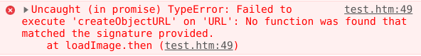

# Promise

<br>

## 大綱
- [什麽是 Promise](#什麽是-promise)
- [預備知識](#預備知識)
- [Promise 起源](#promise-起源)
- 開始探索 Promise
  - [實際模擬 Promise，感受一下 Promise 的串接效果](#實際模擬-promise感受一下-promise-的串接效果)
  - [波動拳：傳統作法 v.s. MyPromise v.s. Promise](#波動拳傳統作法-vs-mypromise-vs-promise)
  - [Promise 的錯誤處理流程](#promise-的錯誤處理流程)
  - [兩條交錯的 Promise，執行順序如何？](#兩條交錯的-promise執行順序如何)
  - [Promise 語法糖：async/await](#接續上面promise-語法糖asyncawait)
- 追根究底
  - [Promise 到底解決什麽問題？](#promise-到底解決什麽問題)
  - [如何正確使用 Promise 和 async/await 實作？](#如何正確使用-promise-和-asyncawait-實作)
  - [進階用法](#進階用法)
- [[回顧] Promise = 保證，是在保證什麽？](#回顧-promise--保證是在保證什麽)

<br>
<hr>
<br>

## 什麽是 Promise
- Promise 是一種工具
- Promise 是一種協助非同步的工具
- Promise 是一種協助非同步「**回呼(回傳呼叫/callback)**」的工具  （注意：不是指執行緒）
- Promise 是一種協助「即將完成或失敗」的非同步回呼工具

- https://developer.mozilla.org/zh-TW/docs/Web/JavaScript/Guide/Using_promises
  <br>Promise 是一個表示非同步運算的最終完成或失敗的物件。

- https://developer.mozilla.org/zh-TW/docs/Web/JavaScript/Reference/Global_Objects/Promise
  <br>Promise 物件代表一個即將完成、或失敗的非同步操作，以及它所產生的值。

<br>
<br>

## 預備知識
> 在閱讀下面的內容前，請先有基本**正確**的認知：
- JS（javascript）不支援多執行緒（Multi-thread / Multithread），所以都是跑在單一執行緒上

- 既然沒有執行緒，為何執行時會看到「非同步執行（非循序執行）」？
  - 那是因為單一執行緒的執行片段，可以有優先權（Priority）的高低，可以參考 [Java 的執行緒概念](https://docs.oracle.com/javase/7/docs/api/java/lang/Thread.html#setPriority(int))
  - 預設優先權通常為 5，最小為 1，最大為 10（這是 Java 的情況）
  
- 對於 JS，只要知道：
  - 呼叫 **setTimeout**, **Promise**, **async/await** 會分割出程式片段，並給予較低的優先權
  - 接著，將這些程式片段放到優先權佇列（priority queue），等待安排執行，讓單一執行緒有非同步的現象
  - 優先權順序：main/UI > Promise(=async/await) > setTimeout
  - setTimeout 優先權最低
  
- setTimeout(()=>{}, 5000) 不等於 Thread.sleep(5000)
  - setTimeout(...) 是把 ```()=>{}``` 這個 function 的程式片段之優先權降到很低
  - 然後丟到優先權佇列（priority queue）
  - 因此，並不會直接卡住 main/UI 執行與更新
  - 而 Thread.sleep(5000) 是直接卡住當前的執行緒
  
- 補充：
  - 最後重申一次，上面所提的都是跑在單一執行緒上
  - 關於「任務優先權」，只是觀察到的行為，不確定 JS 規格是如何實作
  - 有人說是用 {macrotask(宏觀任務) & microtask(微觀任務)} 來解釋，或是用 {主執行緒 + 任務佇列} 來解釋


<br>
<br>

## Promise 起源
> 底下部份內容，參考自 https://developer.mozilla.org/zh-TW/docs/Web/JavaScript/Guide/Using_promises

### 先準備共同的回傳呼叫函數(Callback)
```javascript
// 成功後要回傳呼叫的函數(Callback)，這樣才可以讓呼叫者知道狀況
function successCallback(result) {
    console.log("成功: 結果:", result);
}

// 失敗後要回傳呼叫的函數(Callback)，這樣才可以讓呼叫者知道狀況
function failureCallback(error) {
    console.log("失敗: 錯誤訊息:", error);
}
```

<br>

### callback 的傳統作法
範例程式：([點此看完整程式碼](traditional_callback.js))
```javascript
// 做某些事
function doSomething(successCallback, failureCallback) {
    // 隨機產生 true(50%) 或 false(50%)
    var trueOfFalse = parseInt(Math.floor(Math.random() * 2));
    if (trueOfFalse) {
        successCallback('Done');
    } else {
        failureCallback('(T＿T)');
    }
}

// 呼叫三次
doSomething(successCallback, failureCallback)
doSomething(successCallback, failureCallback)
doSomething(successCallback, failureCallback)
```

執行結果：
```
成功: 結果: Done
失敗: 錯誤訊息: (T＿T)
成功: 結果: Done
```

<br>

### callback 的新的作法 (= Promise)
Promise 概念：
- [點此看完整程式碼](modern_callback.js)
  > 看不懂不要緊，只是 promise 的概念簡介
  > <br>只要了解下面這樣的用法，跟傳統的 callback 用法有差異就可以了
```javascript
let promise = doSomething();
promise.then(successCallback, failureCallback);
```
等價於：
```javascript
let promise = doSomething();
promise
.then(successCallback)
.catch(failureCallback);
```

個人看法：
- 這跟傳統的 listener 作法，根本沒差別啊？
  ```javascript
  // listener 的用法
  let promise = doSomething();
  promise.setSuccessListener(successCallback);
  promise.setFailureListener(failureCallback);
  ```
- Promise 就是 listener 嗎？
- (繼續看下去)


> 新的作法會回傳 promise 物件, 可以在事後附加 callback
> <br>我們稱為「非同步函數呼叫」。([出處](https://developer.mozilla.org/zh-TW/docs/Web/JavaScript/Guide/Using_promises))

<br>

### async callback v.s. thread 的個人看法：
- 上面的作法，應該叫做「非同步函數回呼」比較適當吧?
- 因為「非同步函數呼叫」，會以為是「跑在其他執行緒(thread)上執行」
- 而 promise 只是在事後呼叫 callback，並非是 thread

<br>

### promise v.s. listener 的個人看法：
- promise 並非只是當作 callback，而是用來串接多個小任務
- promise 跟 listener 的差別在於：
  - listenr 函數通常是無回傳值，所以無法串接
  - 而 promise 可以一直串接下去
- 即便 listener 可以串接，它也只是設定 callback，並不是用來執行多個小任務
  ```
  // listener 的用法
  setOnClickListener(listener) {
      this.mOnClickListener = listener;
      return this;
  }
  ```

<br>
<br>

## 實際模擬 Promise，感受一下 Promise 的串接效果

基本架構：
- 第一個任務（最初的任務，位於建構子）是透過「callback」來回報結果
- 後面的任務是透過「回傳值」來回報結果
```javascript
var MyPromise = class {
    constructor(initExecutor) {
        // 最初的任務沒有輸入值
        const resolve = (result) => {
            this.mResult = result;
            this.mState = true;
        };
        const reject = (reject) => {
            this.mError = error;
            this.mState = false;
        };
        initExecutor(resolve, reject);
    }

    then(taskExecutor) {
        if (this.mState) {
            try {
                // 上一個任務的輸出值，當做下一個任務的輸入值
                this.mResult = taskExecutor(this.mResult);
            } catch (error) {
                // 跳過後面接續的 .then(...)，直到遇到 .catch(...)
                this.mState = false;
                
                // error 物件屬性：name, message, stack
                this.mError = error;
            }
        }
        return this;
    }
    
    catch(errorHandler) {
        // 如果沒有錯誤訊息，就不會執行
        if (!this.mState) {
            // 處理目前的錯誤
            errorHandler(this.mError);
            
            // 錯誤已經處理完畢，回復狀態，可以接著執行後面的 .then(...)
            this.mState = true;
            this.mError = null;
        }
        return this;
    }
}
```

<br>
<br>

## 波動拳：傳統作法 v.s. MyPromise v.s. Promise

### 何謂波動拳
- Pyramid of Doom: 金字塔的厄運（中文用「波動拳」來形容）
- 連續執行多個相依任務，形成很深的巢狀結構，導致程式碼縮排太多
  - 如果 user_name 不為空
  - 如果 user_password_new 不為空
  - 如果 user_password_new === user_password_repeat (輸入兩次要一樣)
  - 如果 user_password_new > 5 (密碼程度至少要 6 位以上)
  - 如果 1 < user_name < 65 (使用者名稱符合長度規則)
  - ...
  <br>
  <br>(圖片來源：https://twitter.com/piscis168/status/641237956070666240)
  <br>
  <br>(圖片來源：http://polyglot.ninja/promises-in-javascript/pyramid/)

<br>

### 範例展示，首先定義好要做的任務
- 最初的 task 沒有 input，然後接著有選擇性的 成功/失敗 callback
- 後面的 task 都有 input (上一個 task 的 output)，然後接著有選擇性的 成功/失敗 callback
- callback 敘述是回報給傳統方法
- return 敘述是回報給 Promise

```javascript
function doSomething(successCallback, failureCallback) { // 沒有 input
    console.log("[Task1] 瀏覽 FB 某頁面A");
    successCallback('HTTP 200');
}

function doSomethingElse(params, successCallback, failureCallback) {
    console.log("[Task2] params:", params);
    console.log("[Task2] 頁面自動轉到：使用者登入頁面");
    console.log("[Task2] 登入檢查中...");
    
    // 隨機產生 true(50%) 或 false(50%)
    var trueOfFalse = parseInt(Math.floor(Math.random() * 2));
    var result = {
        allowToAccess: trueOfFalse
    };
    
    if (trueOfFalse) {
        result.text = '登入成功';
        if (successCallback) {
            successCallback(result);
        }
    } else {
        result.text = '登入失敗';
        if (failureCallback) {
            failureCallback(result);
        } else {
            throw result;
        }
    }
    return result;
}

function doThirdThing(params, successCallback, failureCallback) {
    console.log("[Task3] params:", params);
    console.log("[Task3] 自動轉回原本頁面A");
}

function failureCallback(error) {
    console.log("[Error] 錯誤訊息：", error);
    console.log("[Error] 無權限可以瀏覽網頁");
}
```

<br>

### 使用「傳統作法」來串接任務：
```javascript
doSomething( // 瀏覽 FB 某頁面A
    function (result1) {
        doSomethingElse( // 頁面自動轉到：使用者登入頁面
            function (result2) {
                doThirdThing( // 自動轉回原本頁面A
                    function (result3) {
                        console.log("看到頁面內容了!!")
                    }
                )
            },
            failureCallback
        );
    },
    failureCallback
);
```

執行結果1：
```
[Task1] 瀏覽 FB 某頁面A
[Task2] params: HTTP 200
[Task2] 頁面自動轉到：使用者登入頁面
[Task2] 登入檢查中...
[Error] 錯誤訊息： {allowToAccess: false, text: "登入失敗"}
[Error] 無權限可以瀏覽網頁
```

執行結果2：
```
[Task1] 瀏覽 FB 某頁面A
[Task2] params: HTTP 200
[Task2] 頁面自動轉到：使用者登入頁面
[Task2] 登入檢查中...
[Task3] params: {allowToAccess: true, text: "登入成功"}
[Task3] 自動轉回原本頁面A
```

<br>

### 使用「MyPromise」來串接任務：
```javascript
new MyPromise(doSomething)
    .then(function(result0) {
        return doSomethingElse(result0) // =result1
    })
    .then(function(result1) {
        return doThirdThing(result1) // =result2
    })
    .catch(function(error) {
        return failureCallback(error)
    })

```

<br>

### 使用「Promise」來串接任務：
```javascript
new Promise(doSomething)
    .then(function(result0) {
        return doSomethingElse(result0) // =result1
    })
    .then(function(result1) {
        return doThirdThing(result1) // =result2
    })
    .catch(function(error) {
        return failureCallback(error)
    })
```
（又稱為 Promise 鏈）
<br>
示意圖：
<br> 
<br>(圖片來源：http://bbs.zol.com.cn/dcbbs/d657_470983.html)

<br>
<br>程式碼可在簡化為：
```javascript
new Promise(doSomething)
    .then(result0 => doSomethingElse(result0))
    .then(result1 => doThirdThing(result1))
    .catch(error => failureCallback(error))
```

或是更精簡成：
```javascript
new Promise(doSomething)
    .then(doSomethingElse)
    .then(doThirdThing)
    .catch(failureCallback)
```

<br>

### Promise v.s. 一般扁平式作法 的個人看法：
```javascript
function todo() {
    try {
        let result;
        let resolve = function(params) {result = params};
        let reject = function(result) {};
        doSomething(resolve, reject);

        result = doSomethingElse(result);
        result = doThirdThing(result);
    } catch (e) {
        failureCallback(e);
    }
}
todo();
```
- Promise 跟一般扁平式作法，其實沒兩樣
- 幾乎所有的程式語言都有 try-catch，好好善用 try-catch 就可以達到 promise 的效果
- 即便沒有 try-catch，也可以善用 return 來達到 promise 的效果
- 搞了半天，還是舊玩意...

<br>

### Promise v.s. 職責鏈 的個人看法：
- 職責鏈模式(Chain of responsiblity)：
  - 為了讓多個物件都有機會處理請求，透過職責鏈可以避免「發送者」與「接收者」之間的耦合。
  - 將這些物件連成一條鏈，沿著這條鏈傳遞該請求，並加以處理。
- 兩者的核心，看起來是一樣的

<br>
<br>

## Promise 的錯誤處理流程
- 若有錯誤，就會忽略接下來的 .then(...)，直到遇到 .catch(...)
- 錯誤處裡完後，可以處理接下來的 .then(...)

範例程式：
```javascript
new Promise((resolve, reject) => {
    console.log('Init tasks');
    resolve();
})
.then(() => {
    console.log('Do task 1');
})
.then(() => {
    throw new Error('Something failed');
    console.log('Do task 2');
})
.then(() => {
    console.log('Do task 3');
})
.catch(() => {
    console.log('check task errors');
})
.then(() => {
    console.log('Do task A');
})
.then(() => {
    console.log('Do task B');
});
```

執行結果：
```
Do task 1
check task errors
Do task A
Do task B
```

<br>
<br>

## 兩條交錯的 Promise，執行順序如何？
> 先給與結論，在來看程式碼：
> <br>
> <br>假設有兩條 Promise:
> <br>Promise1:  | task1 (1sec) | task2 (1sec) | task3 (1sec) | task4 (1sec) |
> <br>Promise2:  | task5 (5sec) | task6 (5sec) | task7 (5sec) | task8 (5sec) |
> <br>
> <br>執行結果: 1 -> 5 -> 2 -> 6 -> 3 -> 7 -> 4 -> 8
> <br>多條 Promise 是使用 BFS (Breadth First search, 廣度優先搜尋) 方式來執行 task
> <br>跟 task 執行時間長短無關，亦不是採用 FIFO
> <br>

用來消耗 CPU 的計時器：
```javascript
class Timer {
    // 執行過程 CPU 會達到 100%
    static costCpu(loop) {
        let sum = 0;
        for (var i of Array(loop).keys()) {
            sum += i / i;
        }
    }

    static evaluateLoop() {
        if (Timer.loopPerSec !== undefined) {
            return Timer.loopPerSec;
        }

        const LOOP_SIZE = 120 * 1000 * 1000;
	      let startTime = Date.now();
        Timer.costCpu(LOOP_SIZE);
        let endTime = Date.now();

        Timer.loopPerSec = LOOP_SIZE/ ((endTime - startTime) / 1000);
        return Timer.loopPerSec;
    }
    
    static wait(sec) {
        const totalLoop = parseInt(Timer.evaluateLoop() * sec);
        Timer.costCpu(totalLoop);
    }
}
```

建立數個 task：
```javascript
function task0(resolve, reject) {
    console.log('>>> [Task 0] init task');
    resolve();
    console.log('<<< [Task 0] init task');
}

function task1(params) {
    console.log('>>> [Task-1]');
    Timer.wait(5);
    console.log('<<< [Task-1]');
}

function task2(params) {
    console.log('>>> [Task-2] ');
    Timer.wait(5);
    console.log('<<< [Task-2] ');
}

function task3(params) {
    console.log('>>> [Task-3] ');
    Timer.wait(5);
    console.log('<<< [Task-3] ');
}

function task4(params) {
    console.log('>>> [Task-4] ');
    Timer.wait(5);
    console.log('<<< [Task-4] ');
}
```

<br>

底下進行實驗比較：
- 方法一：建立兩條 Promise，並執行
- 方法二：建立兩條 MyPromise，並執行
- 方法三：使用一般常見的扁平式設計，並執行
- 方法四：使用一般常見的扁平式設計，然後套用 Promise 語法糖，並執行

<br>

### 方法一：建立兩條 Promise，並執行
先看看原生的 Promise 所產生的結果：
```javascript
console.log('[main] start');
setTimeout(()=>{
    console.log('>>> [timeout-1] 0');
    Timer.wait(5);
    console.log('<<< [timeout-1] 0');
}, 0);

new Promise(task0).then(task1).then(task2);

console.log('[main] take a rest');
setTimeout(()=>{
    console.log('>>> [timeout-2] 100');
    Timer.wait(5);
    console.log('<<< [timeout-2] 100');
}, 100);

new Promise(task0).then(task3).then(task4);

setTimeout(()=>{
    console.log('>>> [timeout-3] 10');
    Timer.wait(5);
    console.log('<<< [timeout-3] 10');
}, 10);
console.log('[main] end');
```

執行結果：
```
[main] start
>>> [Task 0] init task
<<< [Task 0] init task
[main] take a rest
>>> [Task 0] init task
<<< [Task 0] init task
[main] end
>>> [Task-1]
<<< [Task-1]
>>> [Task-3]
<<< [Task-3]
>>> [Task-2]
<<< [Task-2]
>>> [Task-4]
<<< [Task-4]
>>> [timeout-1] 0
<<< [timeout-1] 0
>>> [timeout-3] 10
<<< [timeout-3] 10
>>> [timeout-2] 100
<<< [timeout-2] 100
```
- Promise 「不會」卡住 main thread
- 尚未執行到的 then(...) 區塊是先放到 queue 中，還沒丟到 worker thread 中，所以產生 task 1,3,2,4 交錯
- 執行中的每一個 task 都不會交錯，一定是完整地做完每一個 task，才會切到下一個 

<br>

真實世界：
- 表面上，看起來 Promise 不會卡住 main thread
- 但實際上，仍會卡住 main thread
- javascript 只是單一執行緒，只是透過優先權(priority)高低來模擬多執行緒
  - UI task 優先權最高
  - promise task 優先權其次
  - setTimeout task 優先權最低

<br>


(圖片來源：https://developer.mozilla.org/zh-TW/docs/Web/JavaScript/Reference/Global_Objects/Promise)

<br>
<br>

### 方法二：建立兩條 MyPromise，並執行
對照 promise 組(方法一)，程式碼都跟上面一樣，但使用假的 MyPromise 來執行：

```javascript
console.log('[main] start');
setTimeout(()=>{
    console.log('>>> [timeout-1] 0');
    Timer.wait(5);
    console.log('<<< [timeout-1] 0');
}, 0);

new MyPromise(task0).then(task1).then(task2);

console.log('[main] take a rest');
setTimeout(()=>{
    console.log('>>> [timeout-2] 100');
    Timer.wait(5);
    console.log('<<< [timeout-2] 100');
}, 100);

new MyPromise(task0).then(task3).then(task4);

setTimeout(()=>{
    console.log('>>> [timeout-3] 10');
    Timer.wait(5);
    console.log('<<< [timeout-3] 10');
}, 10);
console.log('[main] end');
```

執行結果：
```
[main] start
>>> [Task 0] init task
<<< [Task 0] init task
>>> [Task-1]
<<< [Task-1]
>>> [Task-2] 
<<< [Task-2] 
[main] take a rest
>>> [Task 0] init task
<<< [Task 0] init task
>>> [Task-3] 
<<< [Task-3] 
>>> [Task-4] 
<<< [Task-4] 
[main] end
>>> [timeout-1] 0
<<< [timeout-1] 0
>>> [timeout-2] 100
<<< [timeout-2] 100
>>> [timeout-3] 10
<<< [timeout-3] 10
```
- Promise 「會」卡住 main thread
- 除了 setTimeout，整個過程都是依序執行

<br>

### 方法三：使用一般常見的扁平式設計，並執行
與方法二相當
```javascript
console.log('[main] start');
setTimeout(()=>{
    console.log('>>> [timeout-1] 0');
    Timer.wait(5);
    console.log('<<< [timeout-1] 0');
}, 0);

function myPromise1() {
    try {
        task0(
            () => {}, // resolve
            () => {}  // reject
        );
        task1();
        task2();
    } catch (e) {
    }
}
myPromise1();

console.log('[main] take a rest');
setTimeout(()=>{
    console.log('>>> [timeout-2] 100');
    Timer.wait(5);
    console.log('<<< [timeout-2] 100');
}, 100);

function myPromise2() {
    try {
        task0(
            () => {}, // resolve
            () => {}  // reject
        );
        task3();
        task4();
    } catch (e) {
    }
}
myPromise2();

setTimeout(()=>{
    console.log('>>> [timeout-3] 10');
    Timer.wait(5);
    console.log('<<< [timeout-3] 10');
}, 10);
console.log('[main] end');
```

執行結果：
結果完全同**方法二（使用 MyPromise）**

<br>

### 方法四：使用一般常見的扁平式設計，然後套用 Promise 語法糖，並執行
與方法一相當
```javascript
console.log('[main] start');
setTimeout(()=>{
    console.log('>>> [timeout-1] 0');
    Timer.wait(5);
    console.log('<<< [timeout-1] 0');
}, 0);

async function myPromise1() {
    try {
        await task0(
            () => {}, // resolve
            () => {}  // reject
        );
        await task1();
        await task2();
    } catch (e) {
    }
}
myPromise1();

console.log('[main] take a rest');
setTimeout(()=>{
    console.log('>>> [timeout-2] 100');
    Timer.wait(5);
    console.log('<<< [timeout-2] 100');
}, 100);

async function myPromise2() {
    try {
        await task0(
            () => {}, // resolve
            () => {}  // reject
        );
        await task3();
        await task4();
    } catch (e) {
    }
}
myPromise2();

setTimeout(()=>{
    console.log('>>> [timeout-3] 10');
    Timer.wait(5);
    console.log('<<< [timeout-3] 10');
}, 10);
console.log('[main] end');
```

執行結果：
結果完全同**方法一（使用 Promise）**


<br>
<br>

## （接續上面）Promise 語法糖：async/await
以下兩種用法，結果會是如何？（注意 await 關鍵字）

### 用法 A：
```javascript
async function myPromise1() {
    try {
        await task0(
            () => {}, // resolve
            () => {}  // reject
        );
        await task1();
        await task2();
    } catch (e) {
    }
}
myPromise1();
```
執行結果：參考上面方法四

<br>

### 用法 B：
```javascript
async function myPromise1() {
    try {
        task0(        // <--- 要變更的地方，只有這裡，沒有 await
            () => {}, // resolve
            () => {}  // reject
        );
        await task2();
        await task3();
    } catch (e) {
    }
}
myPromise1();
```

<br>

將此用法套入上一小節的「方法四」：
```javascript
console.log('[main] start');
setTimeout(()=>{
    console.log('>>> [timeout-1] 0');
    Timer.wait(5);
    console.log('<<< [timeout-1] 0');
}, 0);

async function myPromise1() {
    try {
        task0(        // <--- 要變更的地方，只有這裡，沒有 await
            () => {}, // resolve
            () => {}  // reject
        );
        await task1();
        await task2();
    } catch (e) {
    }
}
myPromise1();

console.log('[main] take a rest');
setTimeout(()=>{
    console.log('>>> [timeout-2] 100');
    Timer.wait(5);
    console.log('<<< [timeout-2] 100');
}, 100);

async function myPromise2() {
    try {
        task0(        // <--- 要變更的地方，只有這裡，沒有 await
            () => {}, // resolve
            () => {}  // reject
        );
        await task3();
        await task4();
    } catch (e) {
    }
}
myPromise2();

setTimeout(()=>{
    console.log('>>> [timeout-3] 10');
    Timer.wait(5);
    console.log('<<< [timeout-3] 10');
}, 10);
console.log('[main] end');
```

執行結果：
```
[main] start
>>> [Task 0] init task
<<< [Task 0] init task
>>> [Task-1] <----------- task-1 不是 async action
<<< [Task-1] <----------- task-1 不是 async action
[main] take a rest
>>> [Task 0] init task
<<< [Task 0] init task
>>> [Task-3]  <----------- task-3 不是 async action
<<< [Task-3]  <----------- task-3 不是 async action
[main] end
>>> [Task-2] 
<<< [Task-2] 
>>> [Task-4] 
<<< [Task-4] 
undefined
>>> [timeout-1] 0
<<< [timeout-1] 0
>>> [timeout-2] 100
<<< [timeout-2] 100
>>> [timeout-3] 10
<<< [timeout-3] 10
```
- task-1 & task-3 不是 async task
- 第一個 async 標記：會當成在 Promise(...) 建構子的 excutor
- 第二個以後的 async 標記：會放在 .then(...) 區塊執行

<br>

### 如何界定 await 區塊的範圍
- [程式碼](async_and_await__alternating_test.js)
- [執行結果](async_and_await__alternating_results.md)

<br>
<br>

## Promise 到底解決什麽問題？
- Promise 鏈的寫法，用扁平式的傳統寫法就可以辦到了
- 而且幾乎所有的程式語言，都有支援 return, throw/raise 的例外處理
- 何必需要 Promise ?

<br>

- 由於 Javascript 是單一執行緒
- 對於比較沈重的任務，會希望在 main thread 閒置的時候再來執行這個任務
- 因此，會呼叫 setTimeout(...) 來把任務丟到 pririty queue 中
- 問題來了，如果處理過程中發生錯誤，似乎無法捕捉？([出處](https://developer.mozilla.org/zh-TW/docs/Web/JavaScript/Guide/Using_promises))

範例程式：
```javascript
function todo() {
    console.log('>>> todo');
    setTimeout(function() {
        console.log('>>> 處理沈重的任務');
        throw "HTTP 408 Request Timeout";
	console.log(' 處理沈重的任務');
    }, 0);
    console.log('<<< todo');
}

try {
    todo();
} catch(e) {
    console.log('error:', e);
}
```

執行結果：
```
>>> todo
<<< todo
>>> 處理沈重的任務
Uncaught HTTP 408 Request Timeout
```
執行發生錯誤，無法捕捉例外/錯誤...

- [解法] 在 setTimeout 裡捕捉錯誤
```javascript
setTimeout(function() {
    try {
        console.log('>>> 處理沈重的任務');
        throw "HTTP 408 Request Timeout";
	console.log('<<< 處理沈重的任務');
    } catch(error) {
        console.log('在 setTimout 捕捉到 e:', error);
    }
}, 0);
```

<br>

- 如果想要回報 error 給呼叫者，要如何回傳？
```javascript
function todo() {
    console.log('>>> todo');
    const caller = {
        raiseError: function(error) {
            console.log('[caller] error:', error);
            console.log('[caller] error 已經被處理');
        }
    };

    const heavyTask = function(caller) {
        try {
            console.log('>>> 處理沈重的任務');
            throw "HTTP 408 Request Timeout";
	    console.log('<<< 處理沈重的任務');
        } catch(error) {
            caller.error = error;
            caller.raiseError(error);
        }
    }.bind(this, caller);

    setTimeout(function() {
        heavyTask();
    }, 0);

    console.log('<<< todo');
}

todo();
```

執行結果：
```
>>> todo
<<< todo
>>> 處理沈重的任務
[caller] error: HTTP 408 Request Timeout
[caller] error 已經被處理
```

<br>

- 如果想要執行多項任務？
```javascript
function todo() {
    console.log('>>> todo');
    const caller = {
        countTask:0,
        finishTask(self) {
            self.countTask += 1;
	    
	    // 因為是單一執行緒，所以不會有變數同步讀寫問題
            if (self.countTask == 2) {
                console.log('所有的任務都完成了!');
            }
        }
    };

    const heavyTask1 = function(caller) {
        console.log('>>> 處理沈重的任務1');
        Timer.wait(5);
        console.log('<<< 處理沈重的任務1');
        caller.finishTask(caller);
    }.bind(this, caller);

    const heavyTask2 = function(caller) {
        console.log('>>> 處理沈重的任務2');
        Timer.wait(5);
        console.log('<<< 處理沈重的任務2');
        caller.finishTask(caller);
    }.bind(this, caller);

    setTimeout(function() {
        heavyTask1();
    }, 100);
    setTimeout(function() {
        heavyTask2();
    }, 0);

    console.log('<<< todo');
}

todo();
```

執行結果：
```
todo();
>>> todo
<<< todo
>>> 處理沈重的任務2
<<< 處理沈重的任務2
>>> 處理沈重的任務1
<<< 處理沈重的任務1
所有的任務都完成了!
```

若用 Promise 來實作，會變得很精簡：
```javascript
function todo() {
    console.log('>>> todo');

    const task1 = new Promise(resolve => resolve())
    .then(() => {
        console.log('>>> 處理沈重的任務1');
        Timer.wait(5);
        console.log('<<< 處理沈重的任務1');
    });
    const task2 = new Promise(resolve => resolve())
    .then(() => {
        console.log('>>> 處理沈重的任務2');
        Timer.wait(5);
        console.log('<<< 處理沈重的任務2');
    })
    Promise.all([task1, task2]);

    console.log('<<< todo');
}

todo()
```

個人看法：
- Promise 主要應該是用來解決「多個任務控管」的問題，以彌補沒有多執行緒的困擾
- 多個任務的串接，建議使用「扁平式的傳統寫法」即可，不要用 Promise，因為只是循序執行
  - 若使用 Promise.then() 或是 await 來取代，會增加 thread 的 context switch 時間


<br>
<br>

## 如何正確使用 Promise 和 async/await 實作？
```javascript
function todo() {
    console.log('>>> todo');
    try {
        console.log('>>> 處理沈重的任務');
        throw "HTTP 408 Request Timeout";
        console.log('<<< 處理沈重的任務');
    } catch(error) {
        console.log('error:', error);
        console.log('error 已經被處理'); 
    }
    console.log('<<< todo');
}

todo();
```

執行結果：
```
>>> todo
>>> 處理沈重的任務
error: HTTP 408 Request Timeout
error 已經被處理
<<< todo
```

- 如何用 Promise 實作？
```javascript
todo = new Promise((resolve, reject) => {resolve()})
.then(() => {console.log('>>> todo')})
.then(() => {
    console.log('>>> 處理沈重的任務');
    throw "HTTP 408 Request Timeout";
	console.log('<<< 處理沈重的任務');
})
.catch((error) => {
     console.log('error:', error);
     console.log('error 已經被處理');
})
.then(() => {console.log('<<< todo')})
```

- 如何用 async/await 實作？
```javascript
async function todo() {
    const initTask = () => {};
    await initTask();
    await console.log('>>> todo');
    try {
        console.log('>>> 處理沈重的任務');
        throw "HTTP 408 Request Timeout";
        await console.log('<<< 處理沈重的任務');
    } catch(error) {
        console.log('error:', error);
        console.log('error 已經被處理'); 
    }
    await console.log('<<< todo');
}
```

執行結果：同使用 Promise()

<br>
<br>

## 進階用法
### [1] 縮寫用法1
```javascript
.then(successCallback, failureCallback)
```
可以寫成
```javascript
.then(successCallback)
.catch(failureCallback)
```

<br>

### [2] 縮寫用法2
```javascript
.then(null, failureCallback)
```
可以寫成
```javascript
.catch(failureCallback)
```

<br>

### [3] 縮寫用法3-1 (如果不會有 reject，且 value 是空值)
```javascript
new Promise((resolve, reject) => {resolve();})
.then(() => {...})
```

可以忽略 reject 寫成：
```javascript
new Promise((resolve) => {resolve();})
.then(() => {...})
```

或是
```javascript
Promise.resolve()
.then(() => {...})
```

<br>

### [4] 縮寫用法3-2 (如果不會有 reject，但 value 不為空值)
```javascript
new Promise((resolve, reject) => {resolve(value);})
.then((value) => {...})
```

可以忽略 reject 寫成：
```javascript
new Promise((resolve) => {resolve(value);})
.then((value) => {...})
```

或是
```javascript
Promise.resolve(value)
.then((value) => {...})
```

<br>

### [5] 縮寫用法4-1 (如果不會有 resolve，且 reason 是空值)
```javascript
new Promise((resolve, reject) => {reject();})
.catch(() => {...})
```

可以寫成：
```javascript
Promise.reject()
.catch(() => {...})
...
```

<br>

### [6] 縮寫用法4-2 (如果不會有 resolve，但 reason 不為空值)
```javascript
new Promise((resolve, reject) => {reject('unknown error');})
.catch((reason) => {...}) // reason = 'unknown error'
```

可以寫成：
```javascript
Promise.reject('unknown error')
.catch((reason) => {...}) // reason = 'unknown error'
```

<br>

### [7] 仿 Thread.join 功能
> 如果想要像 Thread 一樣，能等 Thread-A & Thread-B 兩者都做完再做事，可以使用 Promise.all([...])
```javascript
function todo() {
    console.log('>>> todo');
    let taskA = Promise.resolve()
    .then(() => console.log('task A1'))
    .then(() => console.log('task A2'))
    .then(() => console.log('task A3'));
    
    let taskB = Promise.resolve()
    .then(() => console.log('task B1'))
    .then(() => console.log('task B2'))
    .then(() => console.log('task B3'))
    .then(() => console.log('task B4'));
    
    let taskC = Promise.resolve()
    .then(() => console.log('task C1'))
    .then(() => console.log('task C2'))
    
    taskX = Promise.all([taskA, taskB, taskC]);
    taskX.then(() => console.log('Done!'));

    console.log('<<< todo');
}
todo();
```

執行結果：
```
>>> todo
<<< todo
task A1
task B1
task C1
task A2
task B2
task C2
task A3
task B3
task B4
Done!
```

執行過程的拆解：主任務：
```javascript
function todo() {
    console.log('>>> todo');
    let taskA = Promise.resolve();
    let taskB = Promise.resolve();
    let taskC = Promise.resolve();
    console.log('<<< todo');
}
```

執行過程的拆解：子任務：
```javascript
function todo() {
    // 這邊不考慮回傳值的串接
    const promiseQueue = [
        [
	    () => console.log('task A1'),
	    () => console.log('task A2'),
	    () => console.log('task A3')
	],
	[
	    () => console.log('task B1'),
	    () => console.log('task B2'),
	    () => console.log('task B3'),
	    () => console.log('task B4')
	],
	[
	    () => console.log('task C1'),
	    () => console.log('task C2')
	]
    ]
    while (promiseQueue.length > 0) {
        for (var idx in promiseQueue) {
            subQueue = promiseQueue[idx];
            if (subQueue.length > 0) {
                f = subQueue.shift();
                f();
            } else {
                promiseQueue.splice(idx, 1);
            }
        }
    }
    console.log('Done!');
}
todo();
```

<br>

### [8] resolve, reject 函數，可以傳兩個以上的參數嗎？不行
```javascript
new Promise((resolve, reject) => {
    resolve('x1', 'y2', 'z3');
}).then((x, y, z) => console.log(`x=${x}, y=${y}, z=${z}`));

// 執行結果：x=x1, y=undefined, z=undefined
```

```javascript
new Promise((resolve, reject) => {
    reject('x1', 'y2', 'z3');
}).catch((x, y, z) => console.log(`x=${x}, y=${y}, z=${z}`));

// 執行結果：x=x1, y=undefined, z=undefined
```

```javascript
Promise.resolve('x1', 'y2', 'z3')
.then((x, y, z) => console.log(`x=${x}, y=${y}, z=${z}`));

// 執行結果：x=x1, y=undefined, z=undefined
```

```javascript
Promise.reject('x1', 'y2', 'z3')
.catch((x, y, z) => console.log(`x=${x}, y=${y}, z=${z}`));

// 執行結果：x=x1, y=undefined, z=undefined
```

<br>

### [10] 如何用 Promise 打包 setTimeout？ ([出處](https://developer.mozilla.org/zh-TW/docs/Web/JavaScript/Guide/Using_promises))
```javascript
var wait = function(ms) {
    return new Promise(function(resolve, reject) {
        setTimeout(resolve, ms);
    });
}

console.log('>>>');
wait(10 * 1000).then(() => {console.log('10 sec. passed');});
console.log('<<<'); // won't be blocked
```

可以簡化為：
```javascript
var wait = ms => new Promise(function(resolve, reject) {
    setTimeout(resolve, ms);
});

console.log('>>>');
wait(10 * 1000).then(() => {console.log('10 sec. passed');});
console.log('<<<'); // won't be blocked
```

再更簡化為：
```javascript
var wait = ms => new Promise(resolve => {setTimeout(resolve, ms);});

console.log('>>>');
wait(10 * 1000).then(() => {console.log('10 sec. passed');});
console.log('<<<'); // won't be blocked
```

```javascript
var wait = ms => new Promise(resolve => setTimeout(resolve, ms));

console.log('>>>');
wait(10 * 1000).then(() => console.log('10 sec. passed'));
console.log('<<<'); // won't be blocked
```

執行結果：
```
>>>
<<<
10 sec. passed
```

<br>

### [10] 如何用 Promise 打包 XMLHttpRequest？ ([出處](https://developer.mozilla.org/zh-TW/docs/Web/JavaScript/Reference/Global_Objects/Promise))
```javascript
function getContent(url) {
    return new Promise((resolve, reject) => {
        let request = new XMLHttpRequest();
        request.open('GET', url);
	request.onload = () => resolve(request.responseText);
	request.onerror = () => reject(request.statusText);
	request.send();	
	
	// 因為非同步(async = true)，此階段尚未取得資料
        console.log('> readyState:', request.readyState); // = XMLHttpRequest.OPENED
        console.log('> response:', request.response.substr(0,100));
        console.log('> responseText:', request.responseText.substr(0,100));
        console.log('> status:', request.status);
        console.log('> statusText:', request.statusText);
    })
}
```

測試：
```
url = 'https://github.com/tsungjung411/javascript-study/tree/master/sample/promise%20%26%20async%20%26%20await'
getContent(url)
    .then((value) => console.log('Content:', value))
    .catch((reason) => console.log('Error:', reason));
console.log('go! go! go!');
```

> 補充：對於 open(method, url, ?async, ?username, ?password) 的第三個選項 async，如果帶入 false，跑在 main thread 下會有警告訊息：
> 
> [Deprecation] Synchronous XMLHttpRequest on the main thread is deprecated because of its detrimental effects to the end user's experience. For more help, check https://xhr.spec.whatwg.org/.

> 實際測試：不管是在 Promise 的 then(...) 區塊、還是在 setTimeout(...) 區塊執行，都會印出 warning。


<br>

### [11] 如何用 Promise 打包 XMLHttpRequest？ (改寫)
```javascript
function getContent(url) {
    return Promise.resolve().then(() => {
        let payload = {};
        let request = new XMLHttpRequest();
        request.open('GET', url, false); // async = false
        request.onload = () => {payload.onload = request.responseText;};
        request.onerror = () => {payload.onerror = request.statusText;};
        request.send(); // blocked
	
        console.log('> readyState:', request.readyState);
        console.log('> response:', request.response.substr(0,100));
        console.log('> responseText:', request.responseText.substr(0,100));
        console.log('> status:', request.status);
        console.log('> statusText:', request.statusText);
	
        if (payload.onerror || request.status != 200) {
            throw request.statusText;
        } else {
            return payload.onload;
        }
    });
}

url = 'https://github.com/tsungjung41111/javascript-study/tree/master/sample/promise%20%26%20async%20%26%20await'
getContent(url)
    .then((value) => console.log('Content:', value))
    .catch((reason) => console.log('Error:', reason));
console.log('go! go! go!');
```

<br>

### [12] 如何用 Promise 和 XMLHttpRequest 來實作非同步下載圖片 ([出處](https://developer.mozilla.org/zh-TW/docs/Web/JavaScript/Reference/Global_Objects/Promise))
```javascript
function loadImage(url) {
    return new Promise((resolve, reject) => {
        var xhr = new XMLHttpRequest();
        xhr.open('GET', url);
        xhr.responseType = 'blob';  // image: binary -> blob
        xhr.onload = () => {
            if (xhr.status == 200) {
                // For example:
                // readyState: 4
                // response: [object Blob]
                // status: 200
                // statusText: 'OK'
                // responseText: 一堆亂碼
                resolve(xhr.response);
            } else {
                // For example:
                // readyState: 4
                // response: [object Blob]
                // status: 404
                // statusText: 'Not Found'
                reject('something wrong:' + xhr.responseText);
            }
        };
        xhr.onerror = () => {
            // readyState: 4
            // response: null
            // status: 0
            // statusText: ''
            reject('Network error'); 
            // network unavailable, 
            // has been blocked by CORS policy: Cross origin requests are only supported for protocol schemes: http, data, chrome, chrome-extension, https.
        };
        xhr.send();
    });
}

var img = new Image(); // or // img = document.createElement('img');
url = 'https://raw.githubusercontent.com/mdn/js-examples/master/promises-test/myLittleVader.jpg';
loadImage(url)
.then((image) => {
    var url = window.URL.createObjectURL(image); // 將 image 轉成 hash code 
    img.src = url;
    document.body.appendChild(img);
});
```

圖片跟文字的主要差別在於：
1. ```xhr.responseType = 'blob'; // image: binary -> blob```
2. ```url = window.URL.createObjectURL(image); // 將 image 轉成 hash code ```

如果把圖片當成文字處理，直接把 responseText 塞到 image 的 src，你會遇到：
<br>

如果只有 [1]，沒有 [2]，你會遇到：
<br>

如果只有 [2]，沒有 [1]，你會遇到：
<br>

當 [1] 和 [2] 都有，你會遇到：
<br>``````

<br>
<br>

## [回顧] Promise = 保證，是在保證什麽？
### 三大保證
- callback 不會在當前的任務執行結束前呼叫
  - → 以 function 為一個執行區塊
- callback 可以透過 ```.then()``` 添加
  - → then() 的參數，本身就是一個 function 的指標，仍然是以 function 為一個執行區塊，但優先權會較低
- 多個 callback 可以透過「重複呼叫 ```.then()```」 來達成
  - → 多個任務的串接方式
  
(~~聽起來就像廢話~~)

Promise = 保證 ＝ 承諾


  
<br>
<br>

## 參考資料
- [[Mozilla] Promise 使用方式](https://developer.mozilla.org/zh-TW/docs/Web/JavaScript/Guide/Using_promises)
- [[Mozilla] Promise 建構式](https://developer.mozilla.org/zh-TW/docs/Web/JavaScript/Reference/Global_Objects/Promise)
- [[Mozilla] async function](https://developer.mozilla.org/zh-TW/docs/Web/JavaScript/Reference/Statements/async_function)
- [[難] JavaScript Promise：簡介](https://developers.google.com/web/fundamentals/primers/promises)

<br>

## 其他閱讀資源
- [You Don't Know JS: ES7: async and await?](https://github.com/getify/You-Dont-Know-JS/blob/master/async%20%26%20performance/ch4.md)
- [[Summer。桑莫。夏天] 你懂 JavaScript 嗎？#25 產生器（Generator）/ asyn / await](https://cythilya.github.io/2018/11/01/generator/)
- [[卡斯伯] 鐵人賽：JavaScript Await 與 Async](https://wcc723.github.io/javascript/2017/12/30/javascript-async-await/)
- [理解 JavaScript 中的 macrotask 和 microtask](https://juejin.im/entry/58d4df3b5c497d0057eb99ff)
